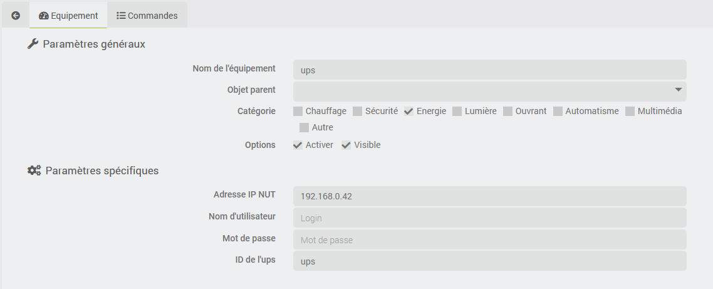

# Nut Plugin

Este complemento le permite recuperar información de un servidor NUT (Network UPS Tools)

## Configuración del plugin

Después de descargar el complemento, solo tiene que activarlo e instalar las dependencias haciendo clic en "Relanzar"

## Configuración del equipo

Se puede acceder a la configuración del equipo NUT desde el menú de complementos :

Así es como se ve la página del complemento NUT (aquí con 1 dispositivo ya) :

Una vez que haces clic en uno de ellos, obtienes :

Aquí encontrarás toda la configuración de tu equipo :

- **Nombre del equipo** : nombre de su equipo NUT,
- **Objeto padre** : indica el objeto padre al que pertenece el equipo,
- **Categoría** : categoría de su equipo NUT
- **Activar** : activa su equipo,
- **Visible** : hace que su equipo sea visible en el tablero,
- **Dirección IP NUT** : La dirección IP del servidor NUT
- **Nombre de usuario** : Nombre de usuario del servidor NUT (dejar en blanco si no hay ninguno)
- **Contraseña** : Contraseña del servidor NUT (dejar en blanco si no hay ninguno)
- **Identificación de ups** : Identificación de ups

> **Calificaciones**
>
> Un servidor NUT puede gestionar varios UPS, entonces es la ID del UPS lo que le permite a Jeedom saber a qué UPS se refiere el equipo
>
> Si no conoce la ID de sus UPS, deje el campo vacío y luego registre el equipo, Jeedom completará automáticamente el campo de ID de la UPS y creará la cantidad de equipos que tenga UPS en su servidor NUT.
>
> Si su servidor NUT está en un NAS de Synology, el nombre de usuario es 'monuser', la contraseña 'secret' y el ID 'ups'. Aunque dejando el área vacía, el complemento lo llena en la mayoría de los casos.

## Configuración de comandos

En la segunda pestaña, encontrará la lista de pedidos, el complemento creará la mayoría de los pedidos automáticamente de acuerdo con la información recibida del servidor NUT.

> **Importante**
>
> Los comandos creados pueden ser diferentes dependiendo de la instalación, depende de lo que envíe el servidor NUT

Si su UPS devuelve información que (todavía) no es compatible con el complemento, puede agregar manualmente un pedido a su equipo.

- Haga clic en el botón *Añadir un pedido*
- Ingresa un nombre
- Elija el subtipo (Numérico, binario u otro)
- En el campo *Configuración* debe ingresar el nombre del valor devuelto por el servidor NUT, la información es visible en el modo DEBUG de inicio de sesión.

> **Importante**
>
> No modifique la configuración de los comandos creados automáticamente por el complemento.
